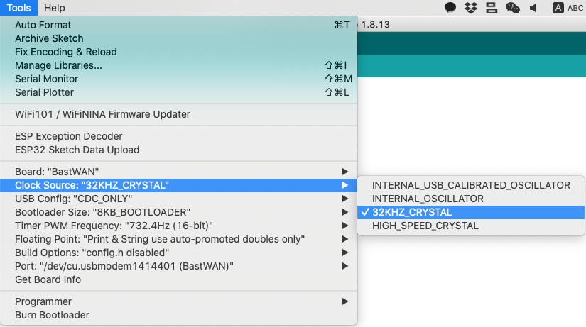
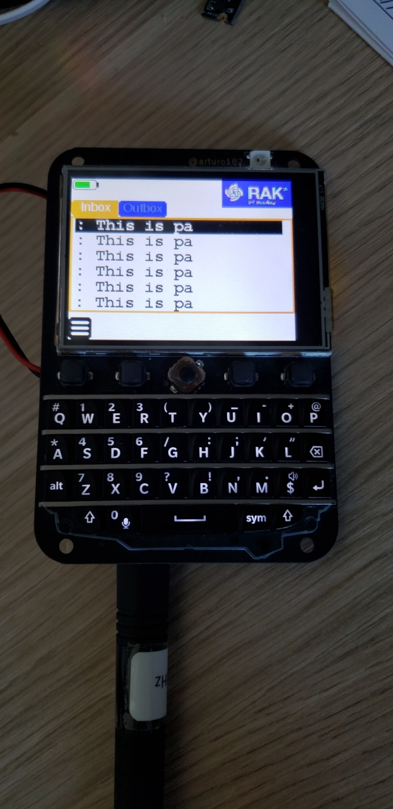
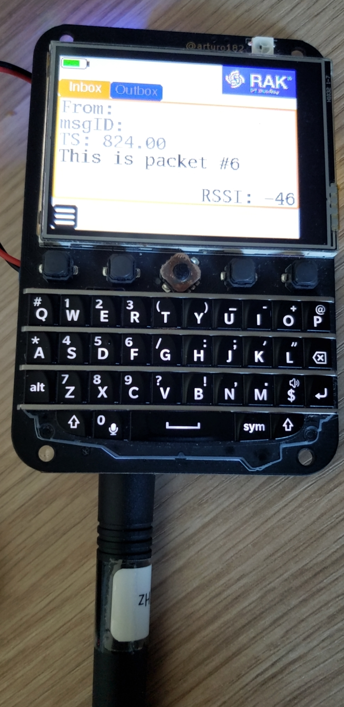

# BastWAN_Timed_Wakeup

An example demonstrating the usage of the ArduinoLowPower library on BastWAN. It is using the [ElectronicCats port of the ArduinoLowPower library](https://github.com/ElectronicCats/ArduinoLowPower), and is based on the TimedWakeup example.

When using this example, you need to set the clock source as `32KHZ_CRYSTAL`, as shown below:



## Setup

The main line of code here is:

```c
  LowPower.attachInterruptWakeup(RTC_ALARM_WAKEUP, dummy, CHANGE);
```

Where `dummy` is a function that will be called on wakeup. Here we'll just increment a counter, for the LoRa packet that will be sent.

```c
void dummy() {
  // This function will be called once on device wakeup
  // You can do some small operations here (like changing variables that will be used in the loop)
  // Remember to avoid calling delay() and long running functions since this function executes in the interrupt context
  count++;
}
```

The in `loop()` we will send a small packet with the `count` updated, and go back to sleep with `LowPower.sleep(30000);`. That's it!



The BastMobile only displays a few characters of the incoming message.



But you have the full message here in the individual message view.